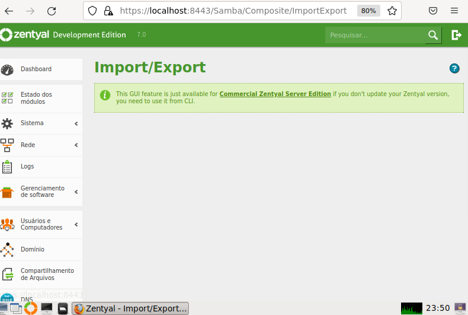

## 📝 CONTEÚDO

- [LINKS](#links)
- [Zentyal](#zentyal)
- [Gerenciadores LDAP](./Gerenciadores-ldap/README.md)

## ⛏️ Zentyal 

🚀 Problema 1: Na versao community nao da pra importar uma base ldap pela GUI. Tem que ser pela linha de comando ( CLI ).

## ⛏️ Links 

- [LDAP](https://www.youtube.com/watch?v=l8BwMlPRMF8) - SERVIDOR LINUX #5 - O que é LDAP? OpenLDAP? AUTENTICAÇÃO com LDAP?

