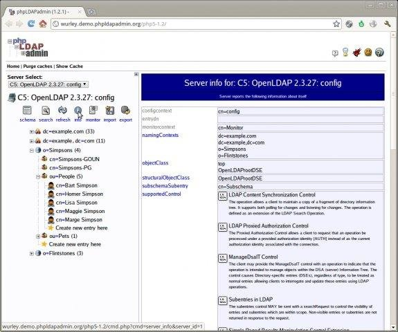
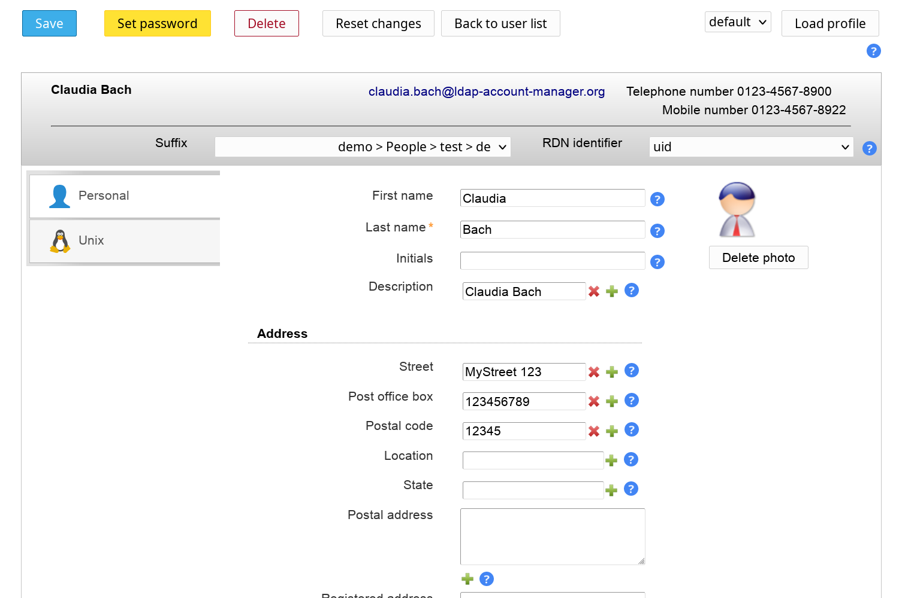

# OPENLDAP


## Sincronizadores
1. OKTA
2. AUTH 0


## Gerenciadores da base ldap
1. opendj
```
https://auth0.com/docs/authenticate/identity-providers/enterprise-identity-providers/active-directory-ldap/ad-ldap-connector#opendj-example

```


2. phpLDAPadmin 
```
http://phpldapadmin.sourceforge.net/wiki/index.php/Main_Page
```


3. LDAP Account Manager
```
https://www.ldap-account-manager.org/lamcms/

``` 
live DEMO > ```https://www.ldap-account-manager.org/lamcms/liveDemo```




## Links
```
* https://www.devmedia.com.br/gerenciamento-de-usuarios-com-openldap-revista-infra-magazine-10/27416

* 

```


## Integração
* LDAP do LastPass https://www.lastpass.com/pt/solutions/integrations/ldap

* 