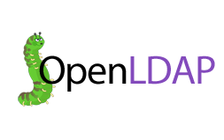

<p align="center">
  <a href="" rel="noopener">
 </a>
</p>

<h3 align="center">OpenLDAP</h3>

---

<p align="center"> Few lines describing your project.
    <br> 
</p>

## 📝 CONTEÚDO

- [LINKS](#links)
- [Getting Started](#getting_started)
- [Gerenciadores LDAP](./Gerenciadores-ldap/README.md)


## ⛏️ Links <a name = "links"></a>

- [CentOS 8](https://app.vagrantup.com/lourranio/boxes/CentOS-Stream-8-x86_64/versions/23.10.2022) - CentOS-Stream-8-x86_64 Vagrant box

- [LDAP](https://www.youtube.com/watch?v=l8BwMlPRMF8) - SERVIDOR LINUX #5 - O que é LDAP? OpenLDAP? AUTENTICAÇÃO com LDAP?

- [php7](https://www.cyberciti.biz/faq/install-php-7-x-on-centos-8-for-nginx/) - How to Install PHP 7.x on CentOS 8 For Nginx
```https://www.cyberciti.biz/faq/install-php-7-x-on-centos-8-for-nginx/```

- [OpenLDAP CentOS 8](https://computingforgeeks.com/install-configure-openldap-server-centos/) - Install and Configure OpenLDAP Server on CentOS 8|RHEL 8

- [LDAP Account Manager (LAM)](https://computingforgeeks.com/install-ldap-account-manager-on-centos//) - Install LDAP Account Manager on CentOS 8
```LDAP Account Manager (LAM) is a web frontend for managing entries (e.g. users, groups, DHCP settings) stored in an LDAP directory. The LDAP Account Manager tool was designed to make LDAP management as easy as possible for the user.```


